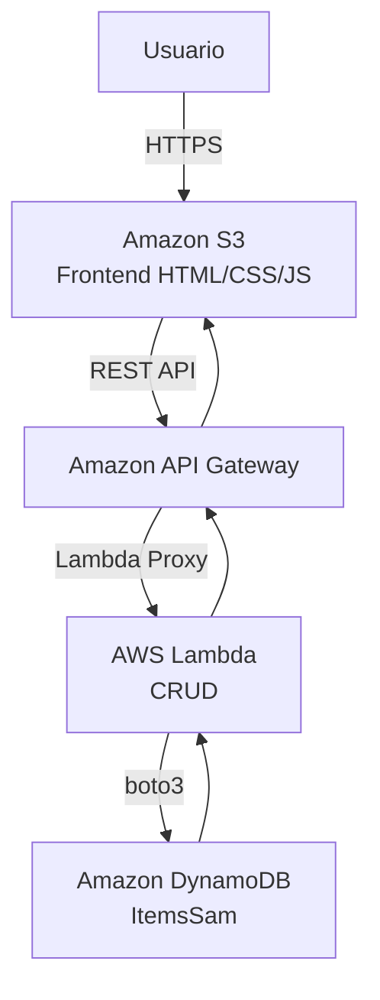

# EXPLICACIÓN DE FUNCIONAMIENTO

La aplicación implementa un sistema CRUD (*Create, Read, Update, Delete*) utilizando servicios *serverless* de Amazon Web Service  (en adelante AWS). El objetivo es permitir la gestión de los registros mediante una interfaz web.

La solución aprovecha los servicios gestionados por AWS que escalan automáticamente según la demanda y reducen tareas de administración y mantenimiento.

## Arquitectura 

La solución esta compuesta por los siguientes servicios:

- **Amazon S3**: Alojamiento del front-end estático (compuesto por HTML, CSS y JS)
- **Amazon API Gateway**: publicación de la API REST usada por el Frontend.
- **AWS Lambda**:  Ejecución lógica de negocio y procesamiento de solicitudes
- **Amazon DynamoDB**: Almacenamiento persistente de los datos.

La arquitectura sigue el siguiente flujo

## Explicación del flujo

1. El usuario accede a la aplicación web alojada en el S3 a través del navegador.
2. El *frontend* muestra la interfaz y le permite hacer las diferentes operaciones CRUD sobre los datos.
3. Cuando el usuario realiza una de las acciones, el navegador envía una petición HTTP hacia la API Gateway
