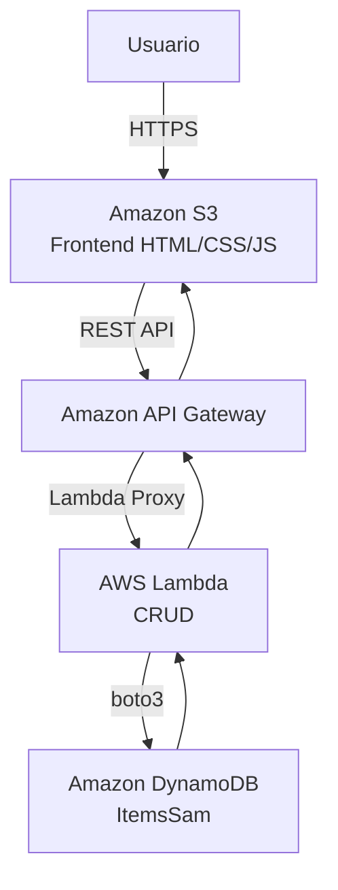

# EXPLICACIÓN DE FUNCIONAMIENTO

La aplicación implementa un sistema CRUD (*Create, Read, Update, Delete*) utilizando servicios *serverless* de Amazon Web Service  (en adelante AWS). El objetivo es permitir la gestión de los registros mediante una interfaz web.

La solución aprovecha los servicios gestionados por AWS que escalan automáticamente según la demanda y reducen tareas de administración y mantenimiento.

## Arquitectura 

La solución esta compuesta por los siguientes servicios:

- **Amazon S3**: Alojamiento del front-end estático (compuesto por HTML, CSS y JS)
- **Amazon API Gateway**: publicación de la API REST usada por el Frontend.
- **AWS Lambda**:  Ejecución lógica de negocio y procesamiento de solicitudes
- **Amazon DynamoDB**: Almacenamiento persistente de los datos.

La arquitectura sigue el siguiente flujo

## Explicación del flujo

1. El usuario accede a la aplicación web alojada en el S3 a través del navegador.
2. El *frontend* muestra la interfaz y le permite hacer las diferentes operaciones CRUD sobre los datos.
3. Cuando el usuario realiza una de las acciones, el navegador envía una petición HTTP hacia la API Gateway
4. API Gateway  actúa como punto único de entrada y recibe todas las solicitudes externas mediante HTTPS
5. API Gateway redirige la petición a la función Lambda correspondiente usando la integración Lambda Proxy.
6. La función Lambda procesa la solicitud , valida los datos y ejecuta la operación necesaria por DynamoDB.
7. DynamoDB almacena o recupera la información solicitada
8. Lambda genera una respuesta en formato JSON y la devuelve a API Gateway.
9. API Gateway envia la respuesta al navegador del usuario.
10. El *frontend* actualiza la interfaz.

## Papel del API Gateway

En esta arquitectura no se utiliza un balanceador de carga tradicional porque no existen instancias EC2 ni contenedores detras de la aplicación.

API Gateway cumple la función de proxy inverso gestionado por AWS y proporciona:

- Recepción de solicitudes HTTP y HTTPS.
- Gestión de rutas y métodos HTTP.
- Integración con funciones Lambda.
- Configuración de CORS.
- Gestión centralizada del acceso de la API
- Escalado automático.

Además, Lambda escala automaticamente según el número de solicitudes recibidas, por lo que no es necesario implementar mecanismos adicionales de balanceo de carga.

## Seguridad de la arquitectura

Esta arquitectura trata de minimizar la superficie de exposición a Internet.

- El único elemento accesible es el API Gateway mediante https
- No se puede acceder directamente a la función lambda a través de internet
- DynamoDB no expone puertos ni conexiones públicas
- No se requiere acceso por SSH ni apertura de puertos.
- La comunicación entre los servicios de AWS se realiza mediante permisos IAM y servicios gestionados.

## Despliegue manual

El despliegue se realiza siguiendo los siguientes pasos:

### 1. Creación de la tabla DynamoDB

Se crea una tabla en Amazon DynamoDB que almacenará los registros gestionados por la aplicación.

Durante esta configuración se define: 

- Nombre de la tabla
- Clave Primaria
- Configuración de capacidad bajo demanda

### 2. Creación de la función lambda

Se crea una función Lambda usando Python como lenguaje de programación.

La función contiene:

* La lógica CRUD.
* La conexión con DynamoDB mediante boto3.
* El procesamiento de eventos enviados por API Gateway.
* La generación de respuestas JSON para el frontend.

### 3. Configurar la API Gateway

Se crea una API REST y se configuran las rutas necesarias.

Cada ruta se asocia a la función Lambda correspondiente mediante integración Lambda Proxy.

También se configuran:

* Métodos HTTP.
* Parámetros de ruta.
* Respuestas HTTP.
* Configuración CORS.

### 4. Subir el *frontend* a Amazon S3

Se crea un bucket S3 configurado como Static Website Hosting.

Posteriormente se cargan los archivos del frontend:

* index.html
* styles.css
* script.js
* docs.html

El bucket proporciona una URL pública desde la que los usuarios pueden acceder a la aplicación.

### 5. Configurar CORS

Se habilita CORS para permitir que el frontend alojado en S3 pueda consumir la API publicada en API Gateway.

Esta configuración permite que el navegador autorice las solicitudes entre ambos servicios, evitando errores de seguridad relacionados con el mismo origen (Same-Origin Policy).

## Despliegue automático

La aplicación incluye un archivo template.yaml basado en AWS SAM (Serverless Application Model).

AWS SAM permite definir la infraestructura como código, facilitando la creación automática de todos los recursos necesarios para ejecutar la aplicación.

Entre los recursos definidos se encuentran:

* Funciones Lambda.
* API Gateway.
* Permisos IAM.
* Variables de entorno.
* Configuración de eventos y rutas.

### Construcción del proyecto

Antes del despliegue se ejecuta:

bash
sam build

Este comando:

* Analiza el archivo template.yaml.
* Prepara los artefactos necesarios.
* Empaqueta el código de las funciones Lambda.

### Despliegue de la infraestructura

Posteriormente se ejecuta:

bash
sam deploy --stack-name aws-crud-practice-sam --capabilities CAPABILITY_IAM

Este comando:

* Crea una pila de AWS CloudFormation.
* Despliega automáticamente los recursos definidos.
* Configura las relaciones entre servicios.
* Actualiza la infraestructura cuando existen cambios.

Durante el desarrollo se reutilizó el rol *LabRole* proporcionado por AWS Academy para evitar restricciones relacionadas con la creación de nuevos roles IAM dentro del entorno académico.

## Operaciones disponibles

La API expone las siguientes operaciones CRUD:

### Crear elemento

*POST /ItemsSam*

Permite crear un nuevo registro en DynamoDB.

Ejemplo de cuerpo de la petición:

json
{
  "id": "1",
  "nombre": "Producto A"
}

### Obtener todos los elementos

*GET /ItemsSam*

Recupera todos los registros almacenados en la tabla.

### Obtener un elemento por ID

*GET /ItemsSam/{id}*

Recupera un registro específico utilizando su identificador único.

Ejemplo:

http
GET /ItemsSam/1

### Actualizar un elemento

*PUT /ItemsSam/{id}*

Permite modificar la información de un registro existente.

Ejemplo:

http
PUT /ItemsSam/1

### Eliminar un elemento

*DELETE /ItemsSam/{id}*

Elimina un registro de la base de datos utilizando su identificador.

Ejemplo:

http
DELETE /ItemsSam/1

## Tratamiento de la información

La información intercambiada entre los componentes sigue el siguiente recorrido:

1. El usuario introduce datos en el formulario del frontend.
2. El navegador genera una petición HTTP con contenido JSON.
3. API Gateway recibe la solicitud y la transforma en un evento para Lambda.
4. Lambda procesa el evento y ejecuta la operación correspondiente.
5. DynamoDB almacena o recupera los datos solicitados.
6. Lambda genera una respuesta estructurada en formato JSON.
7. API Gateway devuelve la respuesta al cliente.
8. El frontend interpreta la respuesta y actualiza la interfaz de usuario.

Este flujo garantiza una separación clara entre presentación, lógica de negocio y almacenamiento de datos.

## Documentación

La documentación automática de la API se proporciona mediante OpenAPI/Swagger y está disponible a través del archivo docs.html.

Esta documentación permite:

* Consultar los endpoints disponibles.
* Visualizar los métodos HTTP soportados.
* Revisar parámetros y respuestas.
* Probar las operaciones directamente desde la interfaz Swagger.
