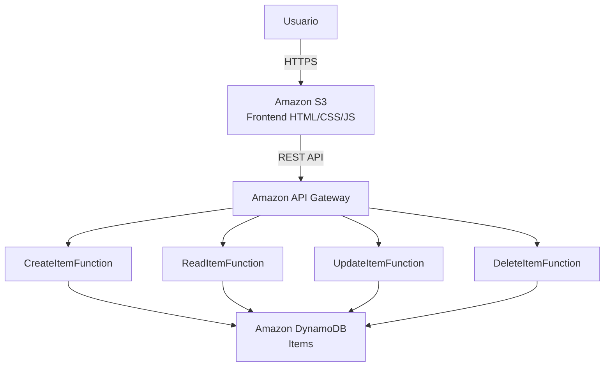
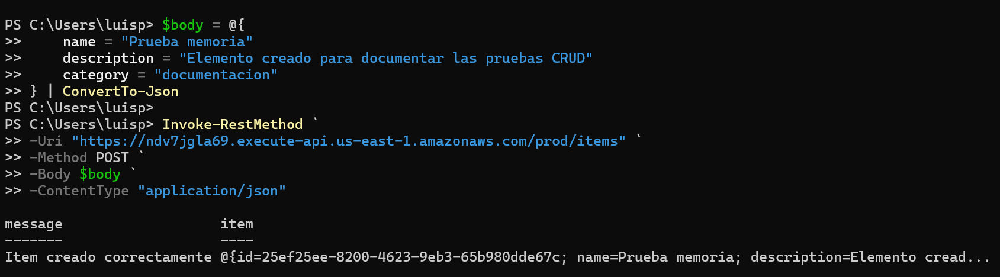
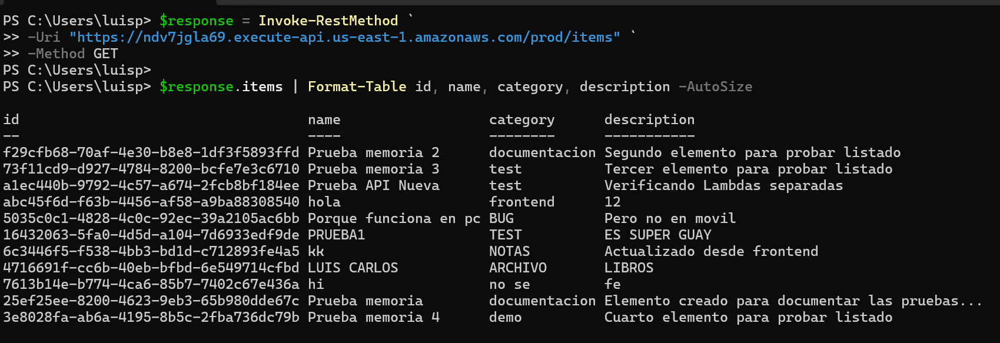
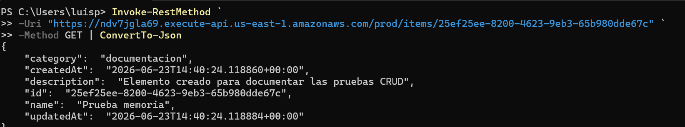
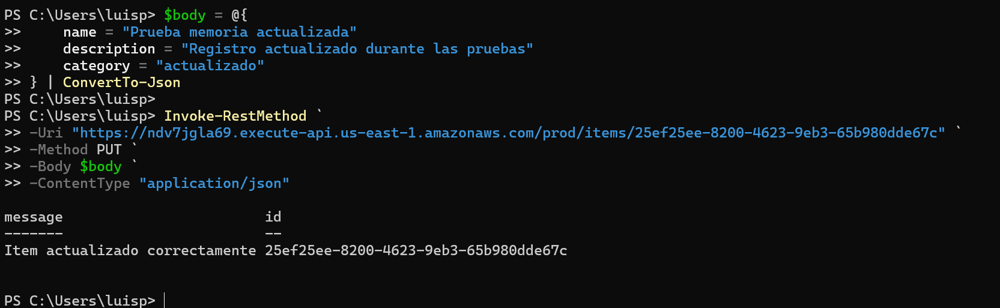
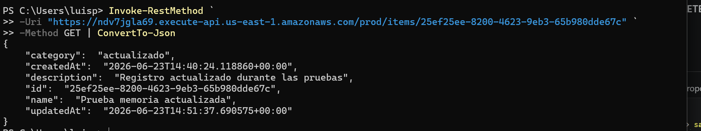

# EXPLICACIÓN DE FUNCIONAMIENTO

La aplicación implementa un sistema CRUD (*Create, Read, Update, Delete*) utilizando servicios *serverless* de Amazon Web Services (AWS). El objetivo es permitir la gestión de registros mediante una interfaz web accesible desde un navegador.

La solución aprovecha servicios gestionados por AWS que escalan automáticamente según la demanda y reducen significativamente las tareas de administración y mantenimiento de infraestructura.

## Arquitectura

La solución está compuesta por los siguientes servicios:

* **Amazon S3**: alojamiento del frontend estático (HTML, CSS y JavaScript).
* **Amazon API Gateway**: publicación y gestión de la API HTTP consumida por el frontend.
* **AWS Lambda**: ejecución de la lógica de negocio mediante funciones independientes para cada operación CRUD.
* **Amazon DynamoDB**: almacenamiento persistente de la información.

La arquitectura sigue el siguiente flujo:



## Explicación del flujo

1. El usuario accede a la aplicación web alojada en Amazon S3.
2. El frontend muestra la interfaz y permite realizar operaciones CRUD sobre los datos almacenados.
3. Cuando el usuario realiza una acción, el navegador envía una petición HTTP a API Gateway.
4. API Gateway actúa como punto único de entrada para todas las solicitudes externas.
5. Dependiendo del método HTTP utilizado, API Gateway invoca la función Lambda correspondiente.
6. La función Lambda procesa la solicitud, valida los datos recibidos y realiza la operación necesaria sobre DynamoDB.
7. DynamoDB almacena o recupera la información solicitada.
8. La función Lambda genera una respuesta en formato JSON.
9. API Gateway devuelve la respuesta al cliente.
10. El frontend actualiza la interfaz con la información recibida.

## Papel de API Gateway

En esta arquitectura no se utilizan balanceadores de carga tradicionales, ya que no existen instancias EC2 ni contenedores detrás de la aplicación.

API Gateway actúa como proxy inverso gestionado por AWS y proporciona:

* Recepción de solicitudes HTTP y HTTPS.
* Gestión de rutas y métodos HTTP.
* Integración con funciones Lambda.
* Configuración de CORS.
* Gestión centralizada del acceso a la API.
* Escalado automático.

Además, AWS Lambda escala automáticamente según el número de solicitudes recibidas, por lo que no es necesario implementar mecanismos adicionales de balanceo de carga.

## Seguridad de la arquitectura

La arquitectura minimiza la superficie de exposición a Internet.

* El único componente accesible directamente es API Gateway mediante HTTPS.
* Las funciones Lambda no son accesibles directamente desde Internet.
* DynamoDB no expone puertos ni conexiones públicas.
* No se requiere acceso SSH ni apertura de puertos.
* La comunicación entre servicios se realiza mediante permisos IAM y servicios gestionados por AWS.

## Despliegue manual

### 1. Creación de la tabla DynamoDB

Se crea una tabla DynamoDB para almacenar los elementos gestionados por la aplicación.

La configuración incluye:

* Nombre de la tabla.
* Clave primaria (`id`).
* Modo de facturación bajo demanda (*Pay Per Request*).

### 2. Creación de las funciones Lambda

Se crean cuatro funciones Lambda independientes:

* `CreateItemFunction`
* `ReadItemFunction`
* `UpdateItemFunction`
* `DeleteItemFunction`

Cada función contiene únicamente la lógica correspondiente a su operación CRUD.

### 3. Configuración de API Gateway

Se crea una API HTTP y se configuran las siguientes rutas:

* `POST /items`
* `GET /items`
* `GET /items/{id}`
* `PUT /items/{id}`
* `DELETE /items/{id}`

Cada ruta se asocia a la función Lambda correspondiente.

### 4. Despliegue del frontend en S3

Se crea un bucket S3 configurado como alojamiento web estático (*Static Website Hosting*).

Posteriormente se cargan los archivos:

* `index.html`
* `styles.css`
* `script.js`
* `docs.html`

### 5. Configuración de CORS

Se habilita CORS para permitir que el frontend alojado en S3 pueda comunicarse con API Gateway.

## Despliegue automático

La aplicación incluye un archivo `template.yaml` basado en AWS SAM (*Serverless Application Model*).

Mediante AWS SAM es posible definir la infraestructura como código (*Infrastructure as Code*), automatizando la creación de los recursos necesarios.

Entre los recursos definidos se encuentran:

* Funciones Lambda.
* API Gateway.
* DynamoDB.
* Variables de entorno.
* Configuración de eventos y rutas.

### Construcción del proyecto

```bash
sam build
```

Este comando:

* Analiza el archivo `template.yaml`.
* Prepara los artefactos necesarios.
* Empaqueta el código de las funciones Lambda.

### Despliegue de la infraestructura

```bash
sam deploy --stack-name aws-crud-practice-sam --capabilities CAPABILITY_IAM
```

Este comando:

* Crea una pila CloudFormation.
* Despliega automáticamente los recursos definidos.
* Configura las relaciones entre servicios.
* Actualiza la infraestructura cuando existen cambios.

Durante el desarrollo se reutilizó el rol `LabRole` proporcionado por AWS Academy para evitar limitaciones relacionadas con la creación de nuevos roles IAM.

## Operaciones disponibles

### Crear elemento

**POST /items**

Permite crear un nuevo registro en DynamoDB.

### Obtener todos los elementos

**GET /items**

Recupera todos los registros almacenados.

### Obtener un elemento por ID

**GET /items/{id}**

Recupera un registro específico utilizando su identificador.

### Actualizar un elemento

**PUT /items/{id}**

Permite modificar un registro existente.

### Eliminar un elemento

**DELETE /items/{id}**

Elimina un registro existente.


## Pruebas de funcionamiento de la API

Para verificar el correcto funcionamiento del sistema se realizaron pruebas sobre todos los endpoints CRUD expuestos por API Gateway.

### Crear elemento — POST /items

Para verificar la operación de creación se realizó una petición POST a la API con los datos de un nuevo elemento.

Comando utilizado:

```powershell
$body = @{
    name = "Prueba memoria"
    description = "Elemento creado para documentar las pruebas CRUD"
    category = "documentacion"
} | ConvertTo-Json

Invoke-RestMethod `
-Uri "https://ndv7jgla69.execute-api.us-east-1.amazonaws.com/prod/items" `
-Method POST `
-Body $body `
-ContentType "application/json"
```


### Obtener todos los elementos — GET /items

Para verificar la operación de consulta global se realizó una petición GET al endpoint principal de la API.

Comando utilizado:

```powershell
$response = Invoke-RestMethod `
-Uri "https://ndv7jgla69.execute-api.us-east-1.amazonaws.com/prod/items" `
-Method GET

$response.items | Format-Table id, name, category -AutoSize
```


### Obtener un elemento por ID — GET /items/{id}

Para verificar la operación de consulta individual se realizó una petición GET indicando el identificador de un elemento previamente almacenado en la base de datos.

Comando utilizado:

```powershell
Invoke-RestMethod `
-Uri "https://ndv7jgla69.execute-api.us-east-1.amazonaws.com/prod/items/25ef25ee-8200-4623-9eb3-65b980dde67c" `
-Method GET | ConvertTo-Json
```

Resultado obtenido:



La API devolvió correctamente la información asociada al identificador solicitado, demostrando el correcto funcionamiento de la búsqueda individual de registros almacenados en DynamoDB.

### Actualizar un elemento — PUT /items/{id}

Para verificar la operación de actualización se realizó una petición PUT sobre un elemento existente, modificando varios de sus atributos.

Comando utilizado:

```powershell
$body = @{
    name = "Prueba memoria actualizada"
    description = "Registro actualizado durante las pruebas"
    category = "actualizado"
} | ConvertTo-Json

Invoke-RestMethod `
-Uri "https://ndv7jgla69.execute-api.us-east-1.amazonaws.com/prod/items/25ef25ee-8200-4623-9eb3-65b980dde67c" `
-Method PUT `
-Body $body `
-ContentType "application/json"
```

Resultado obtenido:



La API respondió correctamente indicando que el elemento había sido actualizado. Esta operación demuestra el correcto funcionamiento de la modificación de registros existentes en DynamoDB.

### Verificación de la actualización — GET /items/{id}

Tras realizar la operación de actualización se ejecutó una nueva consulta sobre el mismo elemento para verificar que los cambios se habían almacenado correctamente en DynamoDB.

Comando utilizado:

```powershell
Invoke-RestMethod `
-Uri "https://ndv7jgla69.execute-api.us-east-1.amazonaws.com/prod/items/25ef25ee-8200-4623-9eb3-65b980dde67c" `
-Method GET | ConvertTo-Json
```

Resultado obtenido:



La respuesta muestra los nuevos valores almacenados en la base de datos, confirmando que la operación de actualización se realizó correctamente y que la información persistió en DynamoDB.


### Eliminar elemento — DELETE /items/{id}
[comando o captura]


## Documentación

La documentación de la API se proporciona mediante OpenAPI/Swagger y está disponible a través de `docs.html`.

Esta documentación permite:

* Consultar los endpoints disponibles.
* Visualizar los métodos HTTP soportados.
* Revisar parámetros y respuestas.
* Probar las operaciones directamente desde la interfaz Swagger.


# Estimación de costes

Se ha realizado una estimación de costes considerando los servicios utilizados por la aplicación:

* Amazon API Gateway
* AWS Lambda
* Amazon S3
* Amazon DynamoDB

Los cálculos se han realizado utilizando los precios vigentes en la región utilizada para el despliegue y considerando distintos escenarios de uso.

## Coste mensual estimado

| Solicitudes mensuales | API Gateway (€) | Lambda (€) | S3 (€) | DynamoDB (€) | Total (€) |
| --------------------- | --------------: | ---------: | -----: | -----------: | --------: |
| 1                     |       0,0000035 |       0,00 |   0,02 |         0,25 |      0,27 |
| 10                    |       0,0000035 |       0,00 |   0,02 |         0,25 |      0,27 |
| 100                   |       0,0000035 |       0,00 |   0,02 |         0,25 |      0,27 |
| 1.000                 |          0,0035 |       0,00 |   0,02 |         0,25 |      0,27 |
| 10.000                |           0,035 |       0,00 |   0,03 |         0,26 |      0,33 |
| 100.000               |            0,35 |       0,00 |   0,06 |         0,31 |      0,72 |
| 300.000               |            1,05 |       0,00 |   0,14 |         0,44 |      1,63 |
| 1.000.000             |            3,50 |       1,80 |   0,42 |         0,88 |     12,00 |

## Coste anual estimado

| Solicitudes mensuales | Coste anual (€) |
| --------------------- | --------------: |
| 1                     |            3,24 |
| 10                    |            3,24 |
| 100                   |            3,24 |
| 1.000                 |            3,28 |
| 10.000                |            3,90 |
| 100.000               |            8,64 |
| 300.000               |           19,56 |
| 1.000.000             |          144,00 |

## Análisis

Los resultados muestran que la arquitectura serverless utilizada presenta un coste muy reducido para cargas bajas y medias.

Hasta aproximadamente 100.000 solicitudes mensuales, el coste total permanece por debajo de 1 € mensual, debido principalmente al modelo de facturación bajo demanda de DynamoDB y al nivel gratuito disponible en AWS Lambda.

Incluso con cargas superiores, el coste continúa siendo reducido en comparación con una solución basada en servidores dedicados o máquinas virtuales en ejecución permanente.

Esto convierte a la arquitectura propuesta en una solución adecuada para proyectos académicos, prototipos, pequeñas aplicaciones web y sistemas con demanda variable.


# Coste de desarrollo

Además del coste de operación de los servicios de AWS, debe contemplarse el coste asociado al desarrollo de la aplicación. Aunque este proyecto se ha realizado en un entorno académico, en un entorno profesional el tiempo invertido por el desarrollador supondría un coste económico que debe tenerse en cuenta.

Para estimar dicho coste se ha realizado una aproximación del tiempo dedicado a las distintas fases del proyecto.

## Estimación del tiempo de desarrollo

| Concepto                       |    Horas |
| ------------------------------ | -------: |
| Diseño de la arquitectura      |      2 h |
| Configuración de DynamoDB      |      2 h |
| Desarrollo de funciones Lambda |      4 h |
| Configuración de API Gateway   |      3 h |
| Desarrollo del frontend        |      4 h |
| Integración y pruebas          |      3 h |
| Documentación                  |     10 h |
| **Total**                      | **28 h** |

Para valorar económicamente este tiempo se ha tomado como referencia el salario medio de un ingeniero informático junior. Tras consultar diversas fuentes, se ha considerado una tarifa media de **13,52 €/hora**.

## Estimación del coste de desarrollo

| Concepto                |        Valor |
| ----------------------- | -----------: |
| Horas de trabajo        |         28 h |
| Tarifa estimada         |    13,52 €/h |
| **Coste de desarrollo** | **378,56 €** |

## Coste total estimado

Tomando como referencia un escenario de utilización moderada de aproximadamente 300.000 solicitudes mensuales, el coste de infraestructura obtenido mediante AWS Pricing Calculator es de aproximadamente **1,63 € al mes**.

Por tanto:

| Concepto                         |        Coste |
| -------------------------------- | -----------: |
| Desarrollo de la aplicación      |     378,56 € |
| Infraestructura AWS (primer mes) |       1,63 € |
| **Coste total primer mes**       | **380,19 €** |

Una vez finalizado el desarrollo, el coste recurrente de operación de la aplicación sería únicamente el derivado de los servicios AWS utilizados, estimado en aproximadamente **1,63 € mensuales** para el escenario considerado.

Estos resultados muestran una de las principales ventajas de las arquitecturas serverless: el coste de infraestructura es muy reducido y la mayor parte de la inversión inicial corresponde al tiempo de desarrollo de la solución.

